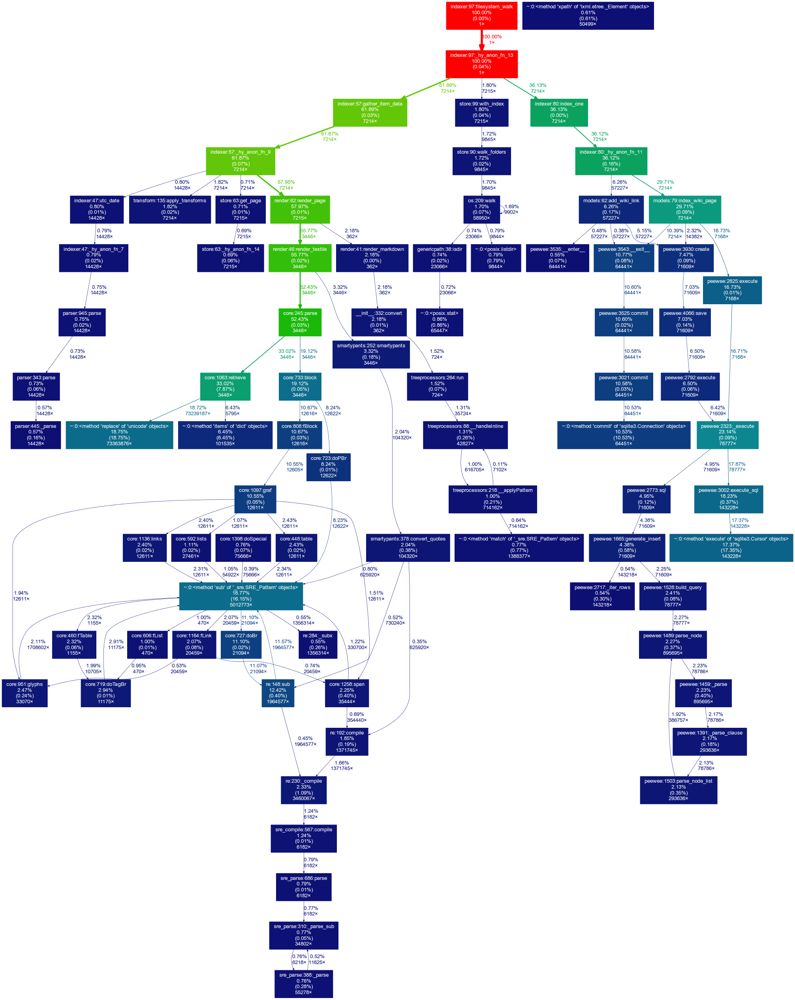

Title: RSS Feeds
Date: 2015-05-17 11:30:00
From: Rui Carmo

Work was insane for the last couple of months, so there was another hiatus in development. After some thought, I decided to remove the `multiprocessing` support from the indexer since the most likely scenario is for this to be deployed on a single-core VPS/micro instance/etc. and it was unnecessarily complex.

Regardless, a bit of profiling shows that it is efficient enough, even though I'm not exactly pleased with the Textile parser:

Once that was done, I whipped up a simple but effective RSS feed generator that inserts inline styling (which I find essential for proper table rendering, etc.). With luck, HTTP handling and new templating are next, followed by a little cleaning up.
